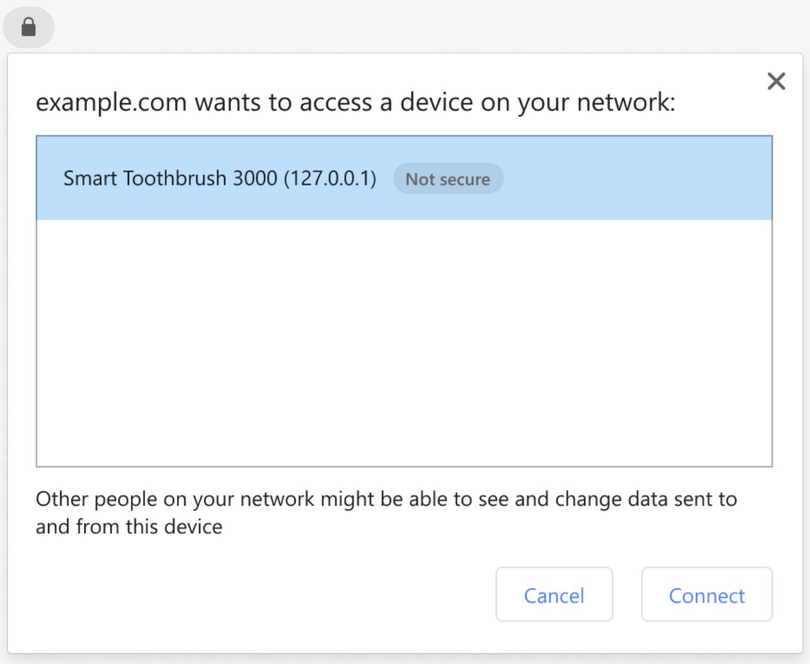

# Private Network Access Permission to relax mixed content 

- **Author**: lyf@google.com
- **Created**: 2022-06-22
- **Last Updated**: 2022-06-27

## Introduction

The Private Network Access specification aims to prevent the user agent from inadvertently enabling attacks on devices running on a user's local intranet, or services running on the user's machine directly. It used to be named "CORS-RFC1918", after [CORS](https://developer.mozilla.org/en-US/docs/Web/HTTP/CORS), which provides a mechanism for securing websites against cross-origin requests, and [RFC 1918](https://tools.ietf.org/html/rfc1918), which describes IPv4 address ranges reserved for private networks.

Preflights and secure-context restrictions have already been introduced. Here, we would like to introduce a new part of the specification: a way to allow plaintext HTTP requests on the private network to be made from an HTTPS page. This would require obtaining a new permission from users with a prompt. It is a way to allow websites to upgrade to HTTPS while relaxing mixed content restrictions and continuing to access specific targets on the private network over plaintext HTTP.

## Goals

The overarching goal is to prevent malicious websites from pivoting through the user agent's network position to attack endpoints on the private network. These endpoints might be devices or services which reasonably assumed they were unreachable from the Internet at large, by virtue of residing on the user’s local intranet or the user's machine.

For example, we wish to mitigate attacks on:

* Software running a web interface on a user’s loopback address. For better or worse, this is becoming a common deployment mechanism for all manner of applications, and often assumes protections that simply don’t exist (see [recent](https://crbug.com/project-zero/679) [examples](https://code.google.com/p/google-security-research/issues/detail?id=693)).

* Users' routers, as outlined in [SOHO Pharming](https://331.cybersec.fun/TeamCymruSOHOPharming.pdf). Note that status quo CORS protections don’t protect against the kinds of attacks discussed here as they rely only on [CORS-safelisted methods](https://fetch.spec.whatwg.org/#cors-safelisted-method) and [CORS-safelisted request-headers](https://fetch.spec.whatwg.org/#cors-safelisted-request-header). No preflight is triggered, and the attacker doesn’t actually care about reading the response, as the request itself is the CSRF attack.

In this particular extension to the base Private Network Access specification, we focus on providing a secure mechanism to allow secure public websites to embed non-secure non-public resources without running into mixed content violations, by instead requesting permission from the user.

### Secure context

Private Network Access specifies that access to the private network is [restricted to secure contexts](https://wicg.github.io/private-network-access/#secure-context-restriction). However, extensive feedback from web developers has been received since then which caused this plan to be put on hold in Chrome. For detailed information, see [Private Network Access: Secure Context Restriction Launch delay](https://docs.google.com/document/d/1bpis0QwaA9ZrRFmpPW6LiaPmdwT0UhhUMNsEnU0zfLk/edit?usp=sharing).

Briefly, the “[Plex](https://plex.tv) solution” consists of provisioning the private server with a certificate for `*.$user_id.foo.example`, then maintaining a DNS service that resolves `10-1-2-3.$user_id.foo.example` to `10.1.2.3`. This allows `https://bar.example` to stream a video from `https://10-1-2-3.$user_id.foo.example/titanic.mp4` directly over the private network. There are even services like [sslip.io](https://sslip.io) that provide this functionality to smaller web apps.

The DNS part of this setup breaks due to some routers (including [Google Wi-Fi](https://support.google.com/wifi/answer/9144137?hl=en)) filtering out DNS responses mapping public domain names to private IP addresses.

Beyond this, the main drawback of this approach is that it degrades system reliability and potentially security by introducing a dependency on the Web PKI and remote DNS servers. In case of DNS unavailability (e.g. in disconnected operation) this simply fails to work, preventing intranet apps from being served securely and making requests to localhost.

### WebTransport

To solve the above problems, we proposed an alternative solution with [WebTransport](https://w3c.github.io/webtransport)’s `serverCertificateHashes` feature. This allows a secure context to establish a secure connection to a local server that only possesses a self-signed certificate.

Unfortunately, it turns out that WebTransport is not a good replacement there. See [spec issue #23](https://github.com/WICG/private-network-access/issues/23).

WebTransport `serverCertificateHashes` requires the website initiating the connection to know in advance the hash of the target server’s certificate. Somehow, they must both agree on the hash value.

WebTransport also requires the server’s certificate expiry be limited to 2 weeks (increasing this limit to X weeks would not resolve the issue). The limit is a mitigation to guard against unsafe certificate practices that are normally prevented by the Web PKI. This means that device manufacturers cannot simply provision a certificate on the device while they still have it, because users cannot be expected to set up the device within weeks of the manufacturer shipping it.

Instead, the device must generate a new certificate at setup time. Somehow, the website must know the hash of this certificate. The easiest solution is for the device to connect to the internet and communicate its identity and certificate hash to the website’s backend. Then, when the user navigates to the website to set up their device, the website can somehow match the user back to the device - by public IP, by user ID, or any other means. The website can then attempt to connect to the device expecting the right hash.

Unfortunately, the IoT ecosystem has been moving away from this model. Our understanding is that in order for a device to get a coveted MFi (“Works with HomeKit”) certification from Apple, it must not require direct internet access for the initial setup.

If the device cannot directly inform the backend of its certificate hash, then both ends must somehow compute the same public key independently. Sounds like a job for [TOTP](https://en.wikipedia.org/wiki/Time-based_one-time_password)! Except that it requires the device to have a moderately accurate clock, which is often not the case when powering devices on for the first time. Once again, this problem could be solved with NTP or somesuch network-based protocol, but the requirement that the device not communicate to the internet precludes this approach.

Long story short, there does not seem to be a way to get out of this bind and achieve our goals with WebTransport.

## A proposal

The previous attempts motivated the switch to a permission-based alternative. We propose that secure contexts be allowed to fetch resources from private network servers over plaintext HTTP - circumventing mixed content restrictions - given express user permission.

At a high level, websites indicate their intention to access a private network server using a new API. The browser then queries the server for some identification information it can display to the user in a permission prompt. The user then chooses if they desire to allow the website to access the target server.

This would mean that websites that wish to speak to private network devices must be served over HTTPS. The target device, however, would not have to serve HTTPS. It would only need to respond correctly to CORS preflights, and maybe to some kind of simple identification request.

### Triggering

Some kind of API to trigger the permission request when accessing a private network server for the first time is required. Here we propose adding a new parameter to the `fetch()` options bag. For example:

```
fetch("http://router.private/ping", {
  targetAddressSpace: "private",
});
```

This would instruct the browser to allow the fetch even though the scheme is non-secure and obtain a connection to the target server. This ensures the feature cannot be abused to bypass mixed content in general.

If the remote IP address does not belong to the IP address space specified as the `targetAddressSpace` option value, then the request is failed.

### Preflight

If it does belong, then a CORS preflight request is sent as specified today. The target server then responds with a CORS preflight response, augmented with the following two headers:

```
Private-Network-Access-Name: <some human-readable device self-identification>
Private-Network-Access-ID: <some unique and stable machine-readable ID, such as a MAC address>
```

For example:

```
Private-Network-Access-Name: "My Smart Toothbrush"
Private-Network-Access-ID: "01:23:45:67:89:0A"
```

### Gaining permission

A prompt is then shown to the user asking for permission to access the target device. Something like:



The `-Name` header is used to present a friendly string to the user instead of, or in addition to, an origin (often a raw IP literal).

The `-ID` header is used to key the permission and recognize the device across IP addresses. Indeed, widespread use of DHCP means that devices are likely to change IP addresses regularly, and we would like to avoid both cross-device confusion and permission fatigue.

If the user decides to grant the permission, then the fetch continues. If not, it fails.

Once the permission is granted, then the document can make arbitrary fetches to the target origin for its entire lifetime, through media tags, XHRs, etc.

The permission is then persisted. The next document belonging to the same initiator origin that declares its intent to access the same server (perhaps at a different origin, if using a raw IP address) does not trigger a permission prompt. The initial CORS preflight response carries the same ID, and the browser recognizes that the document already has permission to access the server.

## What are the alternatives?
### Blanket permission prompt

A simple "attacker.com wants to connect to the private network: allow/deny" prompt. This resembles [what is done in iOS today](https://support.apple.com/en-mk/HT211870).

Such a prompt is hard to understand for users. What even is the private network? It also grants too much privilege at once. A single misclick or wrong judgment call (users often click away prompts to get back to what they were doing) means the website is free to scan the local network for attacks and fingerprinting purposes.

### Fetch the device info differently
One could imagine the name and ID of the device being served some other way, e.g. at a well-known URL: `/.well-known/private-network-access`. It would be fetched first, then the prompt displayed, then the CORS preflight would be sent if permission was granted.

In this model, the API used to trigger the permission prompt could be something else than `fetch()`.

This seems to introduce more complexity for not much benefit. Private Network Access already mandates the use of preflights, two additional headers is the easiest for web developers to implement.

### Identify the target differently

Instead of having the target provide a unique ID, we could use:

* the name: subject to collisions if two similar devices exist on the same network
* the IP address: subject to collisions and churn with DHCP
* the MAC address: does not work if the target is not directly reachable on layer 2
* a public key: complex, would need to design a new protocol to make use of the key later
* the `-ID` and the IP address: in case that multiple devices might accidentally choose the same `-ID`.

### Ephemeral permission

Removes the need of an ID and the permission only lasts as long as the document that requested it. This would result in permission fatigue for services such as Plex, where the same target is accessed repeatedly.

Alternatively, the permission only lasts shortly for a certain origin, similarly to the life cycle of a login session.

### Automatically deny similar requests

To prevent abuse of the permission prompt, we might also want to automatically deny permission in some cases. Here we propose some alternatives:

* Show `cancel` and `allow` instead of `block` and `allow` on the first time the prompt shows and add a “Do not show this again.” check box on the second prompt.
* Automatically deny the request to the same local device in the current document.
* Automatically deny the request to the same local device for the specific public website for a while.

## Security and privacy considerations

See also [`./security_privacy_self_review.md`](./security_privacy_self_review.md)

### IDs

The preflight request sent with plaintext HTTP can be hijacked which means that the `-ID` provided by the local device can be leaked to third-party attackers. However, this also means that the attacker is already in the private network. In this case, it doesn't matter whether the public page is allowed to make requests on the private network  since the attacker can make the request themselves.
